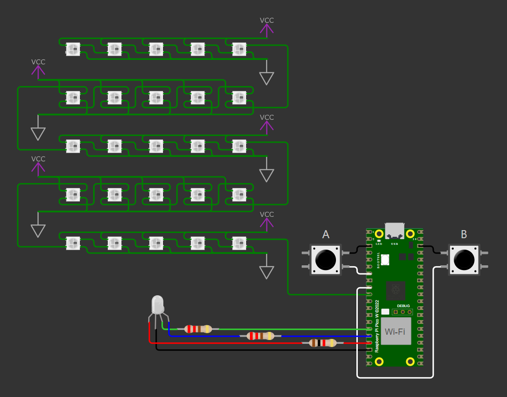
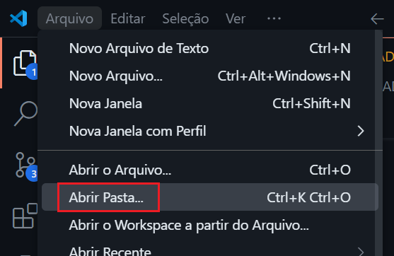
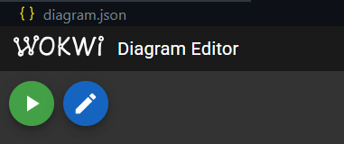

# Utilizando interrupções para gerenciar um contador na matriz de LEDs RGB endereçáveis da placa BitDogLab

## Sumário

1. [💡 O que é este projeto](#1--o-que-é-este-projeto)
2. [⚡ Diagrama do hardware](#2--diagrama-do-hardware)
3. [🎥 Vídeo demonstrativo](#3--vídeo-demonstrativo)
4. [🔎 Funcionalidades disponíveis](#4--funcionalidades-disponíveis)
5. [🧰 Pré-requisitos para executar](#5--pré-requisitos-para-executar)
6. [💻 Como executar a simulação](#6--como-executar-a-simulação)
7. [🐶 Como executar o código na placa BitDogLab](#7--como-executar-o-código-na-placa-bitdoglab)
8. [✨ Recursos para versionamento](#8--recursos-para-versionamento)

## 1. 💡 O que é este projeto

Este é um firmware escrito em C que utiliza o recurso de interrupções do RP2040 para controlar um contador exibido na matriz de LEDs RGB endereçáveis da placa BitDogLab. 

Essa matriz está conectada ao pino GPIO 7 da Raspberry Pi Pico W. É possível incrementar e decrementar o contador pressionando os botões A e B da BitDogLab com a contagem variando de 0 a 9.

Ao mesmo tempo, o LED vermelho conectado ao pino GPIO 13 pisca continuamente com uma frequência de 5 vezes por segundo. Cada ciclo é composto por 50 ms com o LED aceso e 150 ms com o LED apagado.

## 2. ⚡ Diagrama do hardware

Os componentes são conectados de acordo com o esquema abaixo:

## 3. 🎥 Vídeo demonstrativo

Uma demonstração do projeto em funcionamento pode ser assistida no link abaixo:

...

## 4. 🔎 Funcionalidades disponíveis

Ao iniciar a placa, o contador exibe sempre o valor zero e o LED vermelho começa a piscar 5 vezes por segundo.
A partir daí, por meio das teclas A e B da BitDogLab ou da simulação no Wokwi, o usuário pode:

- Pressionar o botão `A` para incrementar o contador;
- Pressionar o botão `B` para decrementar o contador.

Observações:

- Se o contador estiver em `0` e o usuário pressionar `B` para decrementar, a contagem retorna para `9`;
- Se o contador estiver em `9` e o usuário pressionar `A` para incrementar, a contagem retorna para `0`;

## 5. 🧰 Pré-requisitos para executar

A configuração sugerida para executar o projeto é:

1. Ter o [Pico SDK](https://github.com/raspberrypi/pico-sdk) instalado na sua máquina;
2. Ter o [ARM GNU Toolchain](https://developer.arm.com/Tools%20and%20Software/GNU%20Toolchain) instalado na sua máquina;
3. Ter o [Visual Studio Code](https://code.visualstudio.com/download) instalado na sua máquina;
4. Ter este repositório clonado na sua máquina;
5. Ter as seguintes extensões instaladas no seu VS Code:
- [C/C++](https://marketplace.visualstudio.com/items?itemName=ms-vscode.cpptools);
- [CMake](https://marketplace.visualstudio.com/items?itemName=twxs.cmake);
- [CMake Tools](https://marketplace.visualstudio.com/items?itemName=ms-vscode.cmake-tools);
- [Raspberry Pi Pico](https://marketplace.visualstudio.com/items?itemName=raspberry-pi.raspberry-pi-pico);
- [Wokwi Simulator](https://marketplace.visualstudio.com/items?itemName=Wokwi.wokwi-vscode);
6. Ter uma placa BitDogLab disponível e pré configurada na sua máquina;

## 6. 💻 Como executar a simulação

Com os pré-requisitos atendidos, siga os passos a seguir:

1. Utilize o VS Code para abrir a pasta raiz do projeto clonado:

2. Clique em "Compile", à direita da barra de status e aguarde o processo:

3. Abra o arquivo `diagram.json` e clique no botão de play para iniciar a simulação:

4. Quando a simulação iniciar, pressione os botões `A` e `B` para testar o firmware.

## 7. 🐶 Como executar o código na placa BitDogLab

1. Ligue a placa BitDogLab;

2. Pressione e segure o botão `BOOTSEL` no Raspberry Pi Pico W;

3. Pressione e solte o botão `RESET` na BitDogLab;

4. Solte os dois botões anteriores;

5. Conecte a placa ao computador via USB;

6. Pressione o botão "Run" na barra inferior do VS Code.

Após a transferência, a placa reiniciará com o programa em execução.

Observação:

- Como alternativa ao passo 6, é possível transferir o arquivo `.uf2` presente na pasta `build` para o armazenamento da placa.